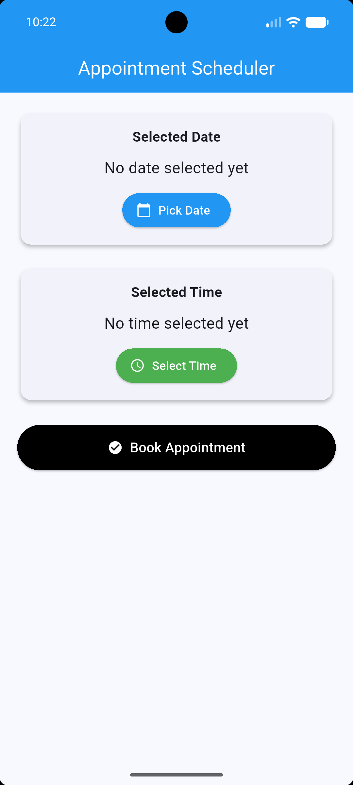
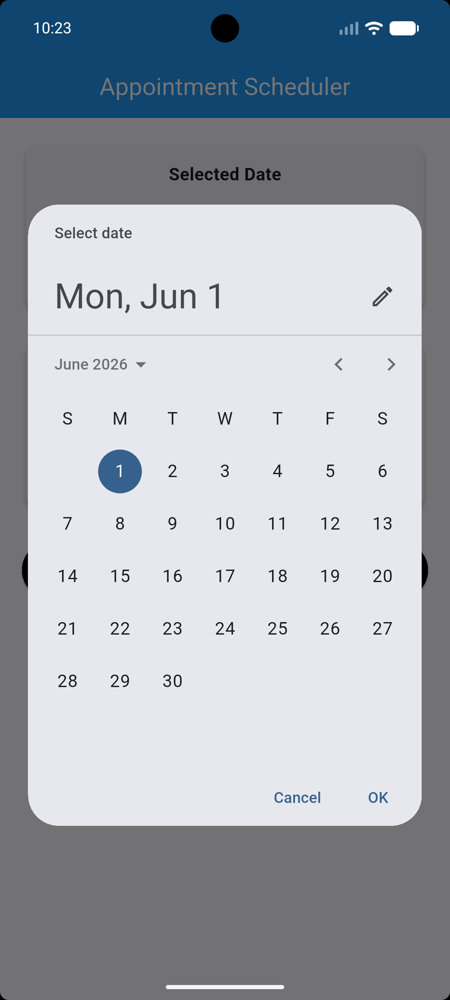
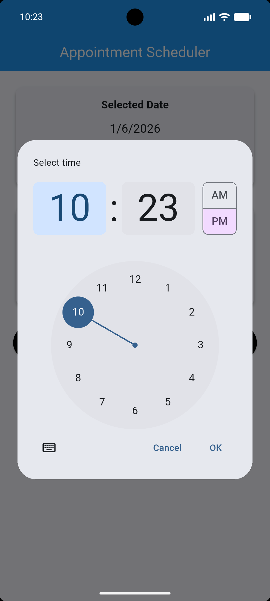
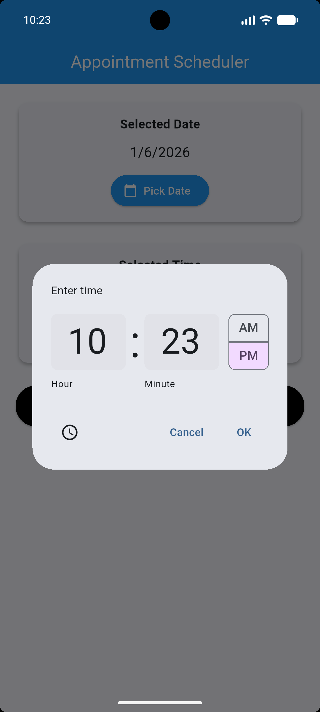
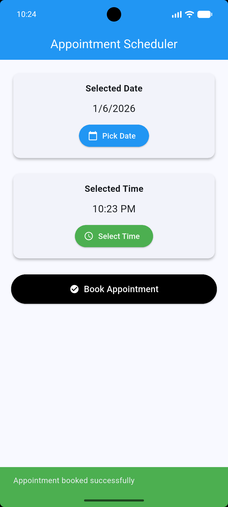
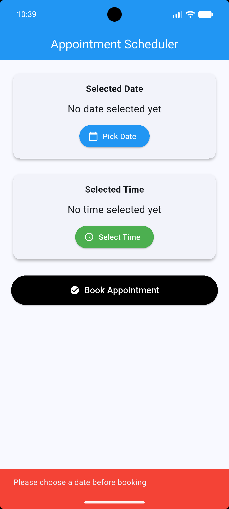
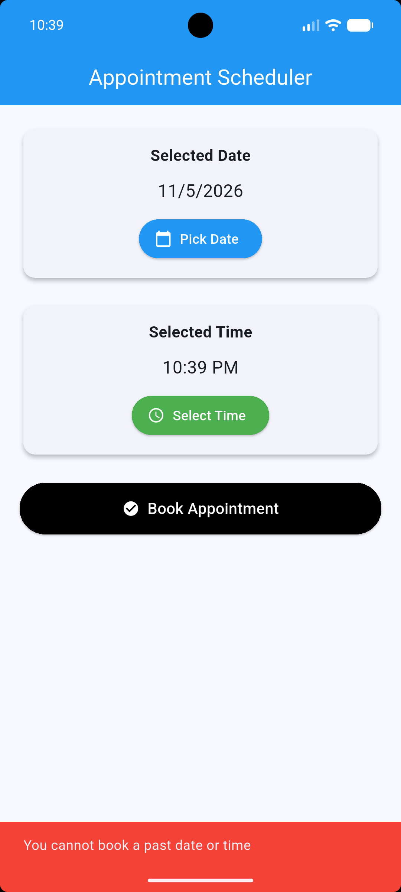

#  Appointment Scheduler App (Flutter)

## Project Overview
This is a simple Flutter application that allows users to select a date and time and book an appointment. It demonstrates the use of Flutter widgets such as DatePicker, TimePicker, Cards, ElevatedButtons, and validation logic to simulate a real-world booking system.

---

## How to Run the Project
Clone the repository:
git clone https://github.com/SMunganyinka/appointment-scheduler-app.git

Navigate into the project folder:
cd appointment-scheduler-app

Get dependencies:
flutter pub get

Run the app:
flutter run

---

## Widget Attribute Notes

Padding (EdgeInsets.all(20)):
Default has no spacing around content, causing UI to touch screen edges. This adds spacing around the entire layout to make the UI clean and readable.

ElevatedButton properties (backgroundColor, foregroundColor, padding):
Default button is plain and grey. These properties customize colors and spacing to improve visibility and user experience.

Date Picker properties (initialDate, firstDate, lastDate):
Default allows full range selection. These properties limit selectable dates and improve input validation by preventing invalid choices.

---

## Validation Logic
The app checks if both date and time are selected before booking. It prevents empty bookings and also blocks past date/time selections. If everything is correct, a success message is shown using SnackBar; otherwise, an error message is displayed.

---

## Screenshots
Add screenshots here:

---

## Conclusion
This project demonstrates Flutter UI design, state management using setState, widget properties customization, and input validation in a simple appointment booking application.

---

## Author
Flutter Assignment Project – Appointment Scheduler App